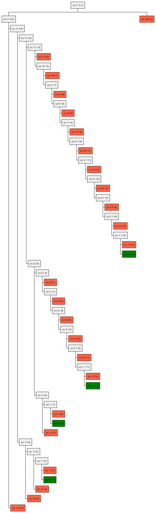

# Exercise 1.14

Draw the tree illustrating the process generated by the `count-change` procedure
of 1.2.2 in making change for 11 cents. What are the orders of growth of the
space and number of steps used by this process as the amount to be changed
increases?

## Answer

The process generated by `count-change` is below, green box denote the leaf
where `count-change` return 1.

Please copy and paste the code to
[the plantuml online editor](https://www.plantuml.com/plantuml/uml/SyfFKj2rKt3CoKnELR1Io4ZDoSa70000)
to see the diagram is not displayed on Github.

  
PlantUML code

See `count-change-visualized` in [`./count-change.rkt`](./count-change.rkt) for
how the diagram was generated, as well as other code to support this exercise.

> What are the orders of growth of the space and number of steps used by this
> process as the amount to be changed increases?

### Space

Given the recursion relationship of $C(a, n)$

$$
C(a, n) = C(a-d_n, n) + C(a, n-1)
$$

Take a special case $a=1$, then $C(1, n)$ will either go down to $C(1-d_n, n)$
or $C(1, n-1)$. The latter would continue $n$ times until we reach $C(1, 0)$.
Thus, the tree is $n$ layers deep when $a=1$.

For $a>1$, it's easy to see that we need $\lceil \frac{a}{min(d_n)} \rceil$ to
reach $C(a', n)$ where $a'<=0$ and the recursion stop. Thus, the depth of the
call tree, denoted as $S(a,n)$, is

$$
S(a, n) = n + \left\lceil \frac{a}{min(d_n)} \right\rceil = \Theta(a)
$$

The approximation is because $a \gg n$ in practice.

See [Test data](#test-data) and experiement with `./count-change.rkt` to verify
the tree depth with above equation.

## Time

Let's use $T(a, n)$ to denote the amount of steps that $C(a, n)$ execute.

We have the following recurrence relationship for $T(a, n)$.

$$
T(a, n) = T(a-d_n, n) + T(a, n-1) + 1
$$

The additional 1 step is used to count the call to `(count-change a n)`.

Let's define $p_i = \lceil \frac{a}{d_i} \rceil$ for $1\le i \le n$ and $d_i$
denotes the coin $i$ value.

Let's also define $a'_i = a - p_i d_i$. By definition of $p_i$, we have
$a'_i \le 0$ for all valid $i$. That means $C(a'_i, k)$ won't go any deeper
($0 \le k \le n$). Thus, $T(a'_i, k) = 1$.

With $n=1$, we need $D_1$ steps to reach $C(a'_1, 1)$ and 1 step to reach
$C(a, 0)$. Hence:

$$
\begin{split}
T(a, 1) & = T(a-d_1, 1) + T(a, 0) + 1 \\
        & = T(a-d_1, 1) + 2           \\
        & = T(a-2d_1, 1) + 4          \\
        & = T(a'_1, 1) + 2p_1         \\
        & = 2p_1 + 1                  \\
\end{split}
$$

Since $p_1 = \left\lceil \frac{a}{d_1} \right\rceil$, we have

$$
T(a, 1) = \Theta\left(\frac{a}{d_1}\right) = \Theta(a) \tag{1}
$$

With $n=2$, we can compute the steps required as:

$$
\begin{split}
T(a, 2) &= T(a - d_2, 2) + T(a, 1) + 1                     \\
        &= T(a - 2d_2, 2) + T(a-d_2, 1) +  T(a, 1) + 2 \\
        &= \dots \\
        &= T(a'_2, 2) + p_2 + \sum_{k=0}^{p_2-1} T(a - k d_2, 1)  \\
        &= p_2 + 1 + \sum_{k=0}^{p_2-1} T(a - k d_2, 1)  \\
        &= p_2 + 1 + \sum_{k=0}^{p_2-1} \left(1 + 2 \left\lceil \frac{a - kd_2}{d_1}\right\rceil \right)  \\
        &= 2p_2 + 1 + 2\sum_{k=0}^{p_2-1} \left\lceil \frac{a - kd_2}{d_1}\right\rceil  \\
\end{split}
\tag{2.1}
$$

Note that the equation (2) is not symetrical. From the book, with $d_1=1$ and
$d_2=5$, we got $T(11, 2) = 43$. However, swapping to $d_1=5$ and $d_2=1$, we
got $T(11, 2) = 59$. This means the algorithm would **run longer (requires more
steps) if we try to use smaller coins first**. The intuition for this is quite
clear: we want $C(a, n)$ to reach the $C(a'_i, n)$ as soon as possible, thus, we
should try to reduce $a$ by larger $d_i$ first.

Let's define $r_i = p_id_i - a$. By the definition of $p_i$, we have
$0 \le r_i \le d_i$. We can simplify $(2.1)$ further using $r_i$.

$$
\begin{split}
T(a,n) &= 2p_2 + 1 + 2\sum_{k=0}^{p_2-1} \left\lceil \frac{a - kd_2}{d_1}\right\rceil  \\
       &= 2p_2 + 1 + 2\sum_{k=0}^{p_2-1} \left\lceil \frac{p_1 d_1 - r_1 - kd_2}{d_1}\right\rceil  \\
       &= 2p_2 + 1 + 2\sum_{k=0}^{p_2-1} \left\lceil p_1 - \frac{r_1 + kd_2}{d_1}\right\rceil  \\
       &= 2p_2 + 1 + 2p_2 p_1 - 2\sum_{k=0}^{p_2-1} \left\lceil \frac{r_1 + kd_2}{d_1}\right\rceil  \\
       &= 2p_2 + 1 + 2p_2 p_1 - F(a, d_1, d_2)
\end{split}
\tag{2.2}
$$

Before finding order of growth of $T(a, 2)$, we should consider the lower bound
of $F(a, d_1, d_2)$

$$
\begin{split}
F(a, d_1, d_2) &= 2\sum_{k=0}^{p_2-1} \left\lceil \frac{r_1 + kd_2}{d_1}\right\rceil  \\
      &> 2\sum_{k=0}^{p_2-1} \frac{r_1 + kd_2}{d_1} \\
      &= 2p_2 \frac{r_1}{d_1} + 2 \frac{d_2}{d_1} \sum_{k=0}^{p_2-1} k \\
      &= 2p_2 \frac{r_1}{d_1} + \frac{d_2}{d_1} p_2 (p_2 - 1) \\
      &> 2\frac{a r_1}{d_1 d_2} + \frac{d_2}{d_1} \frac{a}{d_2} \left( \frac{a}{d_2} - 1 \right) \\
      &> a\frac{2 r_1 + a - d_2}{d_1 d_2} \\
\end{split}
\tag{2.3}
$$

It's now easy to see that $F(a, d_1, d_2) = \Theta(a^2)$.

We can also prove that the remaining component of $T(a,2)$ is also
$\Theta(a^2)$.

$$
\begin{split}
2p_2 + 1 + 2 p_2 p_1 &= 2p_2 (p_1 + 1) + 1 \\
  &= 2\left\lceil \frac{a}{d_2} \right\rceil \left( \left\lceil \frac{a}{d_1} \right\rceil + 1\right) + 1 \\
  &= \Theta\left( a^2 \right)
\end{split}
\tag{2.4}
$$

Combine $(2.2)$, $(2.3)$ and $(2.4)$, we got $T(a, 2) = \Theta(a^2)$. Using
induction, we can prove that

$$
T(a, n) = \Theta(a^n) \tag{3}
$$

## Thoughts

$(3)$ make $T(a, n)$ looks like a crazy big numbers. However, the real result
should be closer to:

$$
T(a, n) = \Theta\left(\frac{a^n}{\prod_{i=1}^{n} d_i}\right) \tag{4}
$$

That explains why the actual numbers in [Test data](#test-data) are very small
compare to $a^n$. I've attempted to find a better formula as well as proving
$(4)$, but I run out of time for this part of the exercise.

In other programming languages, with the array data structure ($O(1)$ random
access), we have a bottom-up [DP solution][my-lc-518] with $\Theta(a)$ space and
$\Theta(a \cdot n)$ time. The book, til this point, hasn't teach us about data
structure yet. Can we find a better solution than $\Theta(a^n)$?

For the special case $n=5$ and fixed $d_i$ like the books, there's some cool
solutions by other people and more info:

- [Sébastien Gignoux's closed form for $T(a, 2)$](https://sicp-solutions.net/post/sicp-solution-exercise-1-14/).
- [Sarabander's math solution that claims to achieve $O(a^2)$ time](https://github.com/sarabander/p2pu-sicp/blob/master/1.2/count-change-challenge/linear-time-cc.scm).
- [A discussion on Math Exchange related to this problem](https://math.stackexchange.com/q/15521).
- Both Sarabander and Math Exchange mentions about George Pólya's math solution
  in [On Picture-Writing](https://www.jstor.org/stable/2309555) (The American
  Mathematical Monthly, Vol. 63, No. 10 (Dec., 1956), pp. 689-697)

[my-lc-518]:
  https://github.com/letientai299/leetcode/blob/master/go/518.coin-change-2.go

## Test data

  
Data for verify the analysis

| amount | kinds | result | steps | depth |
| ------ | ----- | ------ | ----- | ----- |
| 40     | 1     | 1      | 81    | 41    |
| 40     | 2     | 9      | 377   | 42    |
| 40     | 3     | 25     | 749   | 43    |
| 40     | 4     | 31     | 835   | 44    |
| 40     | 5     | 31     | 837   | 45    |
| 41     | 1     | 1      | 83    | 42    |
| 41     | 2     | 9      | 397   | 43    |
| 41     | 3     | 25     | 811   | 44    |
| 41     | 4     | 31     | 913   | 45    |
| 41     | 5     | 31     | 915   | 46    |
| 42     | 1     | 1      | 85    | 43    |
| 42     | 2     | 9      | 415   | 44    |
| 42     | 3     | 25     | 861   | 45    |
| 42     | 4     | 31     | 975   | 46    |
| 42     | 5     | 31     | 977   | 47    |
| 43     | 1     | 1      | 87    | 44    |
| 43     | 2     | 9      | 433   | 45    |
| 43     | 3     | 25     | 911   | 46    |
| 43     | 4     | 31     | 1037  | 47    |
| 43     | 5     | 31     | 1039  | 48    |
| 44     | 1     | 1      | 89    | 45    |
| 44     | 2     | 9      | 451   | 46    |
| 44     | 3     | 25     | 961   | 47    |
| 44     | 4     | 31     | 1099  | 48    |
| 44     | 5     | 31     | 1101  | 49    |
| 45     | 1     | 1      | 91    | 46    |
| 45     | 2     | 10     | 469   | 47    |
| 45     | 3     | 30     | 1011  | 48    |
| 45     | 4     | 39     | 1161  | 49    |
| 45     | 5     | 39     | 1163  | 50    |
| 46     | 1     | 1      | 93    | 47    |
| 46     | 2     | 10     | 491   | 48    |
| 46     | 3     | 30     | 1081  | 49    |
| 46     | 4     | 39     | 1257  | 50    |
| 46     | 5     | 39     | 1259  | 51    |
| 47     | 1     | 1      | 95    | 48    |
| 47     | 2     | 10     | 511   | 49    |
| 47     | 3     | 30     | 1141  | 50    |
| 47     | 4     | 39     | 1335  | 51    |
| 47     | 5     | 39     | 1337  | 52    |
| 48     | 1     | 1      | 97    | 49    |
| 48     | 2     | 10     | 531   | 50    |
| 48     | 3     | 30     | 1201  | 51    |
| 48     | 4     | 39     | 1413  | 52    |
| 48     | 5     | 39     | 1415  | 53    |
| 49     | 1     | 1      | 99    | 50    |
| 49     | 2     | 10     | 551   | 51    |
| 49     | 3     | 30     | 1261  | 52    |
| 49     | 4     | 39     | 1491  | 53    |
| 49     | 5     | 39     | 1493  | 54    |
| 50     | 1     | 1      | 101   | 51    |
| 50     | 2     | 11     | 571   | 52    |
| 50     | 3     | 36     | 1321  | 53    |
| 50     | 4     | 49     | 1569  | 54    |
| 50     | 5     | 50     | 1571  | 55    |
| 51     | 1     | 1      | 103   | 52    |
| 51     | 2     | 11     | 595   | 53    |
| 51     | 3     | 36     | 1407  | 54    |
| 51     | 4     | 49     | 1693  | 55    |
| 51     | 5     | 50     | 1705  | 56    |
| 52     | 1     | 1      | 105   | 53    |
| 52     | 2     | 11     | 617   | 54    |
| 52     | 3     | 36     | 1479  | 55    |
| 52     | 4     | 49     | 1791  | 56    |
| 52     | 5     | 50     | 1805  | 57    |
| 53     | 1     | 1      | 107   | 54    |
| 53     | 2     | 11     | 639   | 55    |
| 53     | 3     | 36     | 1551  | 56    |
| 53     | 4     | 49     | 1889  | 57    |
| 53     | 5     | 50     | 1905  | 58    |
| 54     | 1     | 1      | 109   | 55    |
| 54     | 2     | 11     | 661   | 56    |
| 54     | 3     | 36     | 1623  | 57    |
| 54     | 4     | 49     | 1987  | 58    |
| 54     | 5     | 50     | 2005  | 59    |
| 55     | 1     | 1      | 111   | 56    |
| 55     | 2     | 12     | 683   | 57    |
| 55     | 3     | 42     | 1695  | 58    |
| 55     | 4     | 60     | 2085  | 59    |
| 55     | 5     | 62     | 2105  | 60    |
| 56     | 1     | 1      | 113   | 57    |
| 56     | 2     | 12     | 709   | 58    |
| 56     | 3     | 42     | 1791  | 59    |
| 56     | 4     | 60     | 2229  | 60    |
| 56     | 5     | 62     | 2255  | 61    |
| 57     | 1     | 1      | 115   | 58    |
| 57     | 2     | 12     | 733   | 59    |
| 57     | 3     | 42     | 1875  | 60    |
| 57     | 4     | 60     | 2349  | 61    |
| 57     | 5     | 62     | 2379  | 62    |
| 58     | 1     | 1      | 117   | 59    |
| 58     | 2     | 12     | 757   | 60    |
| 58     | 3     | 42     | 1959  | 61    |
| 58     | 4     | 60     | 2469  | 62    |
| 58     | 5     | 62     | 2503  | 63    |
| 59     | 1     | 1      | 119   | 60    |
| 59     | 2     | 12     | 781   | 61    |
| 59     | 3     | 42     | 2043  | 62    |
| 59     | 4     | 60     | 2589  | 63    |
| 59     | 5     | 62     | 2627  | 64    |
| 60     | 1     | 1      | 121   | 61    |
| 60     | 2     | 13     | 805   | 62    |
| 60     | 3     | 49     | 2127  | 63    |
| 60     | 4     | 73     | 2709  | 64    |
| 60     | 5     | 77     | 2751  | 65    |
| 61     | 1     | 1      | 123   | 62    |
| 61     | 2     | 13     | 833   | 63    |
| 61     | 3     | 49     | 2241  | 64    |
| 61     | 4     | 73     | 2885  | 65    |
| 61     | 5     | 77     | 2941  | 66    |
| 62     | 1     | 1      | 125   | 63    |
| 62     | 2     | 13     | 859   | 64    |
| 62     | 3     | 49     | 2339  | 65    |
| 62     | 4     | 73     | 3031  | 66    |
| 62     | 5     | 77     | 3095  | 67    |
| 63     | 1     | 1      | 127   | 64    |
| 63     | 2     | 13     | 885   | 65    |
| 63     | 3     | 49     | 2437  | 66    |
| 63     | 4     | 73     | 3177  | 67    |
| 63     | 5     | 77     | 3249  | 68    |
| 64     | 1     | 1      | 129   | 65    |
| 64     | 2     | 13     | 911   | 66    |
| 64     | 3     | 49     | 2535  | 67    |
| 64     | 4     | 73     | 3323  | 68    |
| 64     | 5     | 77     | 3403  | 69    |
| 65     | 1     | 1      | 131   | 66    |
| 65     | 2     | 14     | 937   | 67    |
| 65     | 3     | 56     | 2633  | 68    |
| 65     | 4     | 87     | 3469  | 69    |
| 65     | 5     | 93     | 3557  | 70    |
| 66     | 1     | 1      | 133   | 67    |
| 66     | 2     | 14     | 967   | 68    |
| 66     | 3     | 56     | 2759  | 69    |
| 66     | 4     | 87     | 3673  | 70    |
| 66     | 5     | 93     | 3777  | 71    |
| 67     | 1     | 1      | 135   | 68    |
| 67     | 2     | 14     | 995   | 69    |
| 67     | 3     | 56     | 2871  | 70    |
| 67     | 4     | 87     | 3847  | 71    |
| 67     | 5     | 93     | 3963  | 72    |
| 68     | 1     | 1      | 137   | 69    |
| 68     | 2     | 14     | 1023  | 70    |
| 68     | 3     | 56     | 2983  | 71    |
| 68     | 4     | 87     | 4021  | 72    |
| 68     | 5     | 93     | 4149  | 73    |
| 69     | 1     | 1      | 139   | 70    |
| 69     | 2     | 14     | 1051  | 71    |
| 69     | 3     | 56     | 3095  | 72    |
| 69     | 4     | 87     | 4195  | 73    |
| 69     | 5     | 93     | 4335  | 74    |
| 70     | 1     | 1      | 141   | 71    |
| 70     | 2     | 15     | 1079  | 72    |
| 70     | 3     | 64     | 3207  | 73    |
| 70     | 4     | 103    | 4369  | 74    |
| 70     | 5     | 112    | 4521  | 75    |
| 71     | 1     | 1      | 143   | 72    |
| 71     | 2     | 15     | 1111  | 73    |
| 71     | 3     | 64     | 3353  | 74    |
| 71     | 4     | 103    | 4611  | 75    |
| 71     | 5     | 112    | 4789  | 76    |
| 72     | 1     | 1      | 145   | 73    |
| 72     | 2     | 15     | 1141  | 74    |
| 72     | 3     | 64     | 3481  | 75    |
| 72     | 4     | 103    | 4817  | 76    |
| 72     | 5     | 112    | 5013  | 77    |
| 73     | 1     | 1      | 147   | 74    |
| 73     | 2     | 15     | 1171  | 75    |
| 73     | 3     | 64     | 3609  | 76    |
| 73     | 4     | 103    | 5023  | 77    |
| 73     | 5     | 112    | 5237  | 78    |
| 74     | 1     | 1      | 149   | 75    |
| 74     | 2     | 15     | 1201  | 76    |
| 74     | 3     | 64     | 3737  | 77    |
| 74     | 4     | 103    | 5229  | 78    |
| 74     | 5     | 112    | 5461  | 79    |
| 75     | 1     | 1      | 151   | 76    |
| 75     | 2     | 16     | 1231  | 77    |
| 75     | 3     | 72     | 3865  | 78    |
| 75     | 4     | 121    | 5435  | 79    |
| 75     | 5     | 134    | 5685  | 80    |
| 76     | 1     | 1      | 153   | 77    |
| 76     | 2     | 16     | 1265  | 78    |
| 76     | 3     | 72     | 4025  | 79    |
| 76     | 4     | 121    | 5719  | 80    |
| 76     | 5     | 134    | 6007  | 81    |
| 77     | 1     | 1      | 155   | 78    |
| 77     | 2     | 16     | 1297  | 79    |
| 77     | 3     | 72     | 4169  | 80    |
| 77     | 4     | 121    | 5961  | 81    |
| 77     | 5     | 134    | 6275  | 82    |
| 78     | 1     | 1      | 157   | 79    |
| 78     | 2     | 16     | 1329  | 80    |
| 78     | 3     | 72     | 4313  | 81    |
| 78     | 4     | 121    | 6203  | 82    |
| 78     | 5     | 134    | 6543  | 83    |
| 79     | 1     | 1      | 159   | 80    |
| 79     | 2     | 16     | 1361  | 81    |
| 79     | 3     | 72     | 4457  | 82    |
| 79     | 4     | 121    | 6445  | 83    |
| 79     | 5     | 134    | 6811  | 84    |
| 80     | 1     | 1      | 161   | 81    |
| 80     | 2     | 17     | 1393  | 82    |
| 80     | 3     | 81     | 4601  | 83    |
| 80     | 4     | 141    | 6687  | 84    |
| 80     | 5     | 159    | 7079  | 85    |
| 81     | 1     | 1      | 163   | 82    |
| 81     | 2     | 17     | 1429  | 83    |
| 81     | 3     | 81     | 4783  | 84    |
| 81     | 4     | 141    | 7013  | 85    |
| 81     | 5     | 159    | 7453  | 86    |
| 82     | 1     | 1      | 165   | 83    |
| 82     | 2     | 17     | 1463  | 84    |
| 82     | 3     | 81     | 4945  | 85    |
| 82     | 4     | 141    | 7295  | 86    |
| 82     | 5     | 159    | 7771  | 87    |
| 83     | 1     | 1      | 167   | 84    |
| 83     | 2     | 17     | 1497  | 85    |
| 83     | 3     | 81     | 5107  | 86    |
| 83     | 4     | 141    | 7577  | 87    |
| 83     | 5     | 159    | 8089  | 88    |
| 84     | 1     | 1      | 169   | 85    |
| 84     | 2     | 17     | 1531  | 86    |
| 84     | 3     | 81     | 5269  | 87    |
| 84     | 4     | 141    | 7859  | 88    |
| 84     | 5     | 159    | 8407  | 89    |
| 85     | 1     | 1      | 171   | 86    |
| 85     | 2     | 18     | 1565  | 87    |
| 85     | 3     | 90     | 5431  | 88    |
| 85     | 4     | 163    | 8141  | 89    |
| 85     | 5     | 187    | 8725  | 90    |
| 86     | 1     | 1      | 173   | 87    |
| 86     | 2     | 18     | 1603  | 88    |
| 86     | 3     | 90     | 5629  | 89    |
| 86     | 4     | 163    | 8515  | 90    |
| 86     | 5     | 187    | 9161  | 91    |
| 87     | 1     | 1      | 175   | 88    |
| 87     | 2     | 18     | 1639  | 89    |
| 87     | 3     | 90     | 5809  | 90    |
| 87     | 4     | 163    | 8841  | 91    |
| 87     | 5     | 187    | 9535  | 92    |
| 88     | 1     | 1      | 177   | 89    |
| 88     | 2     | 18     | 1675  | 90    |
| 88     | 3     | 90     | 5989  | 91    |
| 88     | 4     | 163    | 9167  | 92    |
| 88     | 5     | 187    | 9909  | 93    |
| 89     | 1     | 1      | 179   | 90    |
| 89     | 2     | 18     | 1711  | 91    |
| 89     | 3     | 90     | 6169  | 92    |
| 89     | 4     | 163    | 9493  | 93    |
| 89     | 5     | 187    | 10283 | 94    |
| 90     | 1     | 1      | 181   | 91    |
| 90     | 2     | 19     | 1747  | 92    |
| 90     | 3     | 100    | 6349  | 93    |
| 90     | 4     | 187    | 9819  | 94    |
| 90     | 5     | 218    | 10657 | 95    |
| 91     | 1     | 1      | 183   | 92    |
| 91     | 2     | 19     | 1787  | 93    |
| 91     | 3     | 100    | 6571  | 94    |
| 91     | 4     | 187    | 10245 | 95    |
| 91     | 5     | 218    | 11161 | 96    |
| 92     | 1     | 1      | 185   | 93    |
| 92     | 2     | 19     | 1825  | 94    |
| 92     | 3     | 100    | 6771  | 95    |
| 92     | 4     | 187    | 10619 | 96    |
| 92     | 5     | 218    | 11597 | 97    |
| 93     | 1     | 1      | 187   | 94    |
| 93     | 2     | 19     | 1863  | 95    |
| 93     | 3     | 100    | 6971  | 96    |
| 93     | 4     | 187    | 10993 | 97    |
| 93     | 5     | 218    | 12033 | 98    |
| 94     | 1     | 1      | 189   | 95    |
| 94     | 2     | 19     | 1901  | 96    |
| 94     | 3     | 100    | 7171  | 97    |
| 94     | 4     | 187    | 11367 | 98    |
| 94     | 5     | 218    | 12469 | 99    |
| 95     | 1     | 1      | 191   | 96    |
| 95     | 2     | 20     | 1939  | 97    |
| 95     | 3     | 110    | 7371  | 98    |
| 95     | 4     | 213    | 11741 | 99    |
| 95     | 5     | 252    | 12905 | 100   |
| 96     | 1     | 1      | 193   | 97    |
| 96     | 2     | 20     | 1981  | 98    |
| 96     | 3     | 110    | 7611  | 99    |
| 96     | 4     | 213    | 12223 | 100   |
| 96     | 5     | 252    | 13483 | 101   |
| 97     | 1     | 1      | 195   | 98    |
| 97     | 2     | 20     | 2021  | 99    |
| 97     | 3     | 110    | 7831  | 100   |
| 97     | 4     | 213    | 12649 | 101   |
| 97     | 5     | 252    | 13987 | 102   |
| 98     | 1     | 1      | 197   | 99    |
| 98     | 2     | 20     | 2061  | 100   |
| 98     | 3     | 110    | 8051  | 101   |
| 98     | 4     | 213    | 13075 | 102   |
| 98     | 5     | 252    | 14491 | 103   |
| 99     | 1     | 1      | 199   | 100   |
| 99     | 2     | 20     | 2101  | 101   |
| 99     | 3     | 110    | 8271  | 102   |
| 99     | 4     | 213    | 13501 | 103   |
| 99     | 5     | 252    | 14995 | 104   |
| 100    | 1     | 1      | 201   | 101   |
| 100    | 2     | 21     | 2141  | 102   |
| 100    | 3     | 121    | 8491  | 103   |
| 100    | 4     | 242    | 13927 | 104   |
| 100    | 5     | 292    | 15499 | 105   |

