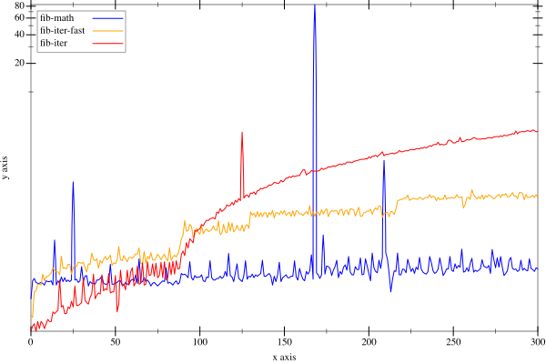

# Exercise 1.19

There is a clever algorithm for computing the Fibonacci numbers in a logarithmic
number of steps. Recall the transformation of the state variables $a$ and $b$ in
the `fib-iter` process of 1.2.2: $a \leftarrow a+b$ and $b \leftarrow a$.

Call this transformation $T$, and observe that applying $T$ over and over again
$n$ times, starting with 1 and 0, produces the pair $Fib(n+1)$ and $Fib(n)$. In
other words, the Fibonacci numbers are produced by applying $T^n$, the $n^{th}$
power of the transformation $T$, starting with the pair $(1, 0)$.

Now consider $T$ to be the special case of $p=0$ and $q=1$ in a family of
transformation $T_{pq}$, where $T_{pq}$ transforms the pair $(a, b)$ according
to $a \leftarrow ap +q(a+b)$ and $b \leftarrow bp + aq$.

Show that if we apply such a transformation $T_{pq}$ twice, the effect is the
same as using a single transformation $T_{p'q'}$ of the same form, and compute
$p'$ and $q'$ in terms of $p$ and $q$.

This gives us an explicit way to square these transformations, and thus we can
compute $T^n$ using successive squaring, as in the `fast-expt` procedure. Put
this all together to complete the following procedure, which runs in a
logarithmic number of steps:

```racket
(define (fib n)
  (fib-iter 1 0 0 1 n))

(define (fib-iter a b p q count)
  (cond ((= count 0)
         b)
        ((even? count)
         (fib-iter a
                   b
                   ⟨??⟩  ;compute p'
                   ⟨??⟩  ;compute q'
                   (/ count 2)))
        (else
         (fib-iter (+ (* b q)
                      (* a q)
                      (* a p))
                   (+ (* b p)
                      (* a q))
                   p
                   q
                   (- count 1)))))
```

## Answer

After 2nd $T_{pg}$ transformation, from the pair $(a, b)$ we have a new pair
$(a', b')$.

$$
\begin{split}
a' &= p(ap + q(a+b)) + q(ap + q(a+b) + bp + aq) \\
   &= a(p^2 + q^2) + (a+b)(2pq + q^2) \\
b' &= p(bp + aq) + q(ap + q(a+b)) \\
   &= b(p^2 + q^2) + a(2pq + q^2)
\end{split}
\tag{1}
$$

Let's define $p'=p^2 + q^2$, $q'=2pq+q^2$, and use $T_{pq}^n$ to say that we
apply $T_{pq}$ exactly $n$ times. From $(1)$, we have:

$$
T_{pq}^2 = T_{p'q'}.
$$

See `fib-iter-fast` in [`./fib.rkt`](./fib.rkt). Below graph show how execution
time grow for the 3 fast Fibonacci solutions we have implemented so far
(`fib-rec` is too slow to be included).


