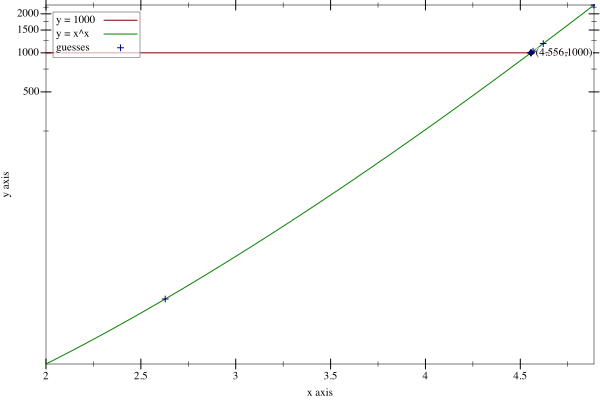
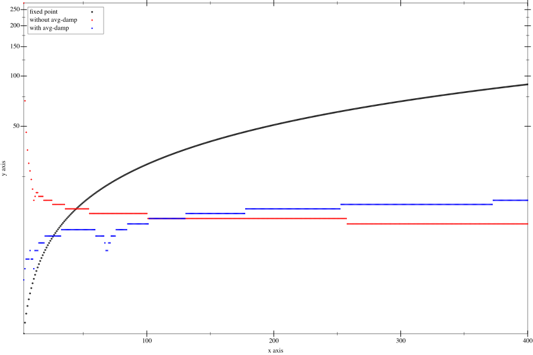

# Exercise 1.36

Modify `fixed-point` so that it prints the sequence of approximations it
generates, using the `newline` and `display` primitives shown in
[Exercise 1.22](./1.22.md). Then find a solution to $x^x=1000$ by finding a
fixed point of $x \mapsto log(1000)/log(x)$. (Use Scheme’s primitive `log`
procedure, which computes natural logarithms.) Compare the number of steps this
takes with and without average damping. (Note that you cannot start
`fixed-point` with a guess of 1, as this would cause division by $log(1)=0$.)

## Answer

Let's first understand how can we make the connection from $x^x = n$ (here,
$n=1000$) to the `fixed-point` procedure.

$$
\begin{split}
& x^x & = n \\
\implies & x log(x) & = log(n)                \\
\implies & x & = \frac{log(n)}{log(x)} \\
\end{split}
$$

Thus, $x$ is the fixed point of $f(x) = \frac{k}{log(x)}$ with $k = log(n)$.

For the trivial case $n=1$

Next, we need to find a good first guess. Otherwise, `fixed-point` might crash
(if we start with 1, as hinted), or won't converge.

Note that if $x\nearrow$ ($x$ increase) then $k/log(x) \searrow$, and vice
versa. Thus, our first guess, $x_0$, should satisfy that

$$
x_0 \le \frac{k}{log(x_0)}
$$

For the special case $n = 1000$, we know that $k = log(n) \gt 1$, and the fixed
point $x_{fix} \gt 1$. So, it's safe to start with $x_0 \le \sqrt{k}$, so that
$x_0^2 \le k$, which means $x_0 \le k/x_0 \le k/log(x_0)$.

For more general case where $n \in \mathbb{R+}$, we can choose other first guess
depends on where $k$ is relatively to 0 and 1.

Below graph shows the sequence generated by `fixed-point` relative to $x^x$,
**without average damping**. We start with $x_0 = \sqrt{log(1000)}$, and
tolerante was set to 0.00001.

| Iteration | Guess              |
| --------- | ------------------ |
| 1         | 2.628260884878466  |
| 2         | 7.148499833163998  |
| 3         | 3.5119967587151617 |
| 4         | 5.4989962768458875 |
| 5         | 4.0525019149434955 |
| 6         | 4.936457680288313  |
| 7         | 4.326410866025396  |
| 8         | 4.7160337677820126 |
| 9         | 4.453834406958009  |
| 10        | 4.624391036822288  |
| 11        | 4.5109081602758945 |
| 12        | 4.5853051183541504 |
| 13        | 4.536050899068398  |
| 14        | 4.568449635026386  |
| 15        | 4.547047104713045  |
| 16        | 4.561145901437509  |
| 17        | 4.551841160490859  |
| 18        | 4.557974481900732  |
| 19        | 4.553928375131203  |
| 20        | 4.556596143215001  |
| 21        | 4.554836554809641  |
| 22        | 4.555996863891463  |
| 23        | 4.555231615332503  |
| 24        | 4.555736262307768  |
| 25        | 4.555403448272989  |
| 26        | 4.555622929103472  |
| 27        | 4.5554781839321965 |
| 28        | 4.555573639950043  |
| 29        | 4.555510688173682  |
| 30        | 4.555552203558996  |
| 31        | 4.555524824877711  |
| 32        | 4.555542880581305  |
| 33        | 4.555538825880839  |

**With average damping**, the series converge much faster, only 8 iterations

| Iteration | Guess             |
| --------- | ----------------- |
| 1         | 2.628260884878466 |
| 2         | 4.888380359021232 |
| 3         | 4.620737190334996 |
| 4         | 4.566987478722323 |
| 5         | 4.557496448848509 |
| 6         | 4.555869862580356 |
| 7         | 4.555592607978149 |
| 8         | 4.555537354760776 |

Average damping, _in this case_, helps to ensure the next guess is closer to the
fixed point. That's not always happen, however. See the next section.

## Effect of average damping

Below graph show how many iterations needed to complete `fixed-point` procedure
with and without average damping in these configurations:

- $n$ was chosen to be $e^k$, where $e$ is the [Euler's constant][euler]:
  $2.71828\ldots$. This aims to simplify the numeric computation related to the
  $log$ function, with is Racket built-in natural logarithm (i.e. base $e$).
- $k$ is between 3 and 400.
- First guess is 6, as it's best to visualize the multiple up and down movements
  when using average damping (blue color).

[euler]: https://en.wikipedia.org/wiki/Euler%27s_constant

Observation:

- The interation counts for both with and without `average-damp` have multiple
  up and down movements (as $k$ go up). However, the trends are:
  - Without `avg-damp`: start high, go down.
  - Using `avg-damp`: start low, go up.
- **After a point**, average damping **slows down** the converging speed.

I'm unable to find the formula to compute number of iterations, so I'll stop
this exercise here.

## Code

See [`./1.36.rkt`](./1.36.rkt).
