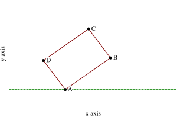

# Exercise 2.3

Implement a representation for rectangles in a plane. (Hint: You may want to
make use of [Exercise 2.2](./2.2.md).) In terms of your constructors and
selectors, create procedures that compute the perimeter and the area of a given
rectangle. Now implement a different representation for rectangles. Can you
design your system with suitable abstraction barriers, so that the same
perimeter and area procedures will work using either representation?

## Answer

To solve this exercise, we need pick a good way to describe the rectangle such
that these properties are ensured:

- Has 4 _right_ angles
- Has 4 separated corners, otherwise, it's effectively a point.

We can't simply define `make-rectangle` as a procedure that takes 4 points, as
that force the users to ensure those 4 points satisfy the 4 right angles
property. This means our `make-rectangle` should take an origin, 2 positive
numbers that represent the _width_ and _height_.

Next, as we are working with 2d coordinates system, we should have an _angle_
for the rectangle. With only 3 inputs (origin, width and height), we can't
identify exactly 1 rectangle.


So, we need the 4 input, an angle which is used to compute the 2nd point
coordinates from the origin and the first value of the 2 sides. Our
`make-rectangle` would be defined like this.

```scheme
(define (make-rectangle origin angle width height)
  ...)
```



We need to compute coordinates of $B$, $C$ and $D$ with these info:

- Origin $A(x, y)$
- Angle $\alpha = \angle{(\overrightarrow{Ox}, \overrightarrow{AB})}$
- Width $w = |\overline{AB}| = |\overline{CD}|$.
- Height $h = |\overline{BC}| = |\overline{AD}|$.

It's not so difficult to prove the following formula to compute $x_B, y_B$

$$
\begin{split}
x_B &= x + w\cos \alpha \\
y_B &= y + w\sin \alpha \\
\end{split}
$$

Similarly, we can easily compuete coordinates of $D$

$$
\begin{split}
x_D &= x + h\cos \left(\frac{\pi}{2} + \alpha\right) \\
y_D &= y + h\sin \left(\frac{\pi}{2} + \alpha\right) \\
\end{split}
$$

Finally, we can compute $C$ as using the knowledge of rectangle's center point.

$$
\begin{split}
x_C &= x_B + x_D - x \\
y_C &= y_B + y_D - y \\
\end{split}
$$

So, we have a well-defined _constructor_ `make-rectangle` that can uniquely
_identify_ a rectange from the inputs. Now, we need to think about other
requirements:

- From the exercise: implement `rectangle-perimeter` and `rectangle-area`.
- For my own purpose: make it easy to draw above visualizations, thus, needs
  selectors for all the corners, e.g. `rectangle-points`.

If we simply store `width` and `height` (together with `origin` and `angle`),
those selectors like `rectangle-width`, `rectangle-height` would be straight
forward. However, `rectangle-points` would be expensive, and should we need a
procedure to extract a single corner, it would need to do all the computation
above.

On the other hand, if we store the computed points, we can derive `width` and
`height` with much fewer computations (no need to involve `sin`, `cos`). Our
`rectangle-points` is cheap and simple.

Either case, if we define the selectors `rectangle-width` and `rectange-height`,
our abstraction barrier can satisfy the exercise requirement.

See [`./2d-plane.rkt`](./2d-plane.rkt) for the related code.
