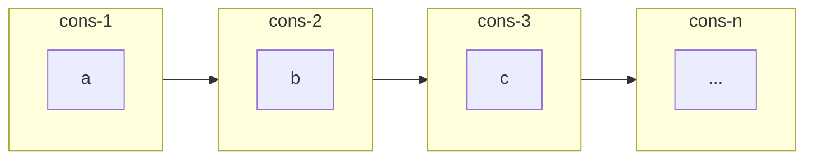
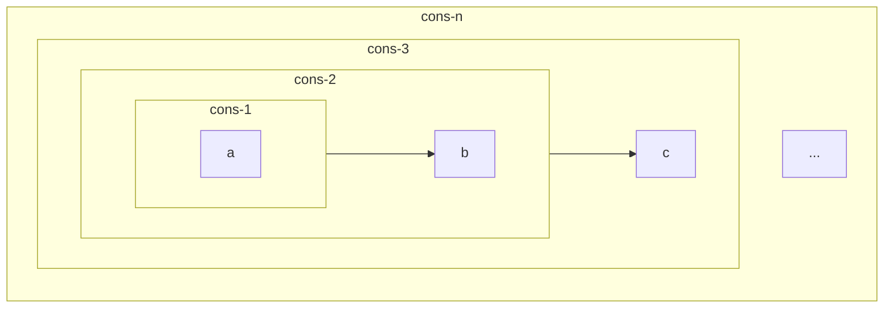

# Exercise 2.22

Louis Reasoner tries to rewrite the first `square-list` procedure of
[Exercise 2.21](./2.21.md) so that it evolves an iterative process:

```scheme
(define (square-list items)
  (define (iter things answer)
    (if (null? things)
        answer
        (iter (cdr things)
              (cons (square (car things))
                    answer))))
  (iter items nil))
```

Unfortunately, defining `square-list` this way produces the answer list in the
reverse order of the one desired. Why?

Louis then tries to fix his bug by interchanging the arguments to `cons`:

```scheme
(define (square-list items)
  (define (iter things answer)
    (if (null? things)
        answer
        (iter (cdr things)
              (cons answer
                    (square
                     (car things))))))
  (iter items nil))
```

This doesn’t work either. Explain.

## Answer

The first version builds the `answer` by adding the new squared number at the
beginning of the previous `answer`.

```scheme
(cons (square (car things)) answer)
```

This causes the `answer` to be build from tail to head, i.e. in reversed order.

The second version produce the wrong result. The expected result should be:

```scheme
(cons a 
  (cons b 
    (cons ...))
```

which can be visualized like below



The code creates the following result

```scheme
(cons (cons (cons a) b) ...)
```

Which can be visualized as


