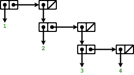
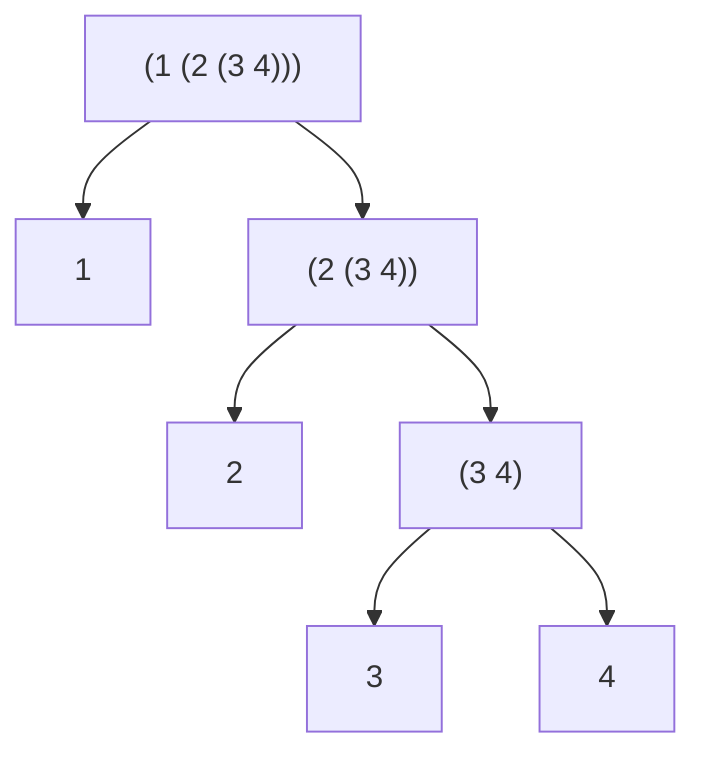

# Exercise 2.24

Suppose we evaluate the expression `(list 1 (list 2 (list 3 4)))`. Give the
result printed by the interpreter, the corresponding box-and-pointer structure,
and the interpretation of this as a tree (as in [Figure 2.6][fig-2.6]).

[fig-2.6]: https://sarabander.github.io/sicp/html/2_002e2.xhtml#Figure-2_002e6

## Answer

The evaluation

```scheme
(list 1 (list 2 (list 3 4)))
'(1 (2 (3 4)))
```

Box and pointer (created using [sdraw][sdraw] and
[`../../utils/draw.rkt`](../../utils/)).



[sdraw]: https://docs.racket-lang.org/sdraw

View it as a tree


