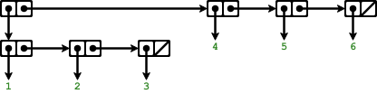
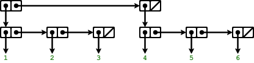

# Exercise 2.26

Suppose we define `x` and `y` to be two lists:

```scheme
(define x (list 1 2 3))
(define y (list 4 5 6))
```

What result is printed by the interpreter in response to evaluating each of the
following expressions:

```scheme
(append x y)
(cons x y)
(list x y)
```

## Answer

```scheme
(append x y)
> '(1 2 3 4 5 6)
(cons x y)
> '((1 2 3) 4 5 6)
(list x y)
> '((1 2 3) (4 5 6))
```

Note how `(cons x y)` and `(list x y)` creates different results. As explained
in the book, `list` is actually `(cons a (cons b (cons ...))`.

Using the substitution model, `(cons x y)` will become

```scheme
(cons x (cons 4 (cons 5 (cons 6))))
```



That's why it's printed as such. On the other hand, `(list x y)` will become

```scheme
(cons x (cons y null))
```


