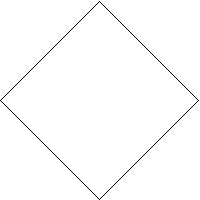
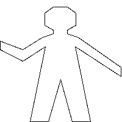

# Exercise 2.49

Use `segments->painter` to define the following primitive painters:

1. The painter that draws the outline of the designated frame.
2. The painter that draws an “X” by connecting opposite corners of the frame.
3. The painter that draws a diamond shape by connecting the midpoints of the
   sides of the frame.
4. The `wave` painter.

## Answer

[`./picture-lang.rkt`](./picture-lang.rkt)

> 1. The painter that draws the outline of the designated frame.

> 2. The painter that draws an “X” by connecting opposite corners of the frame.

> 3. The painter that draws a diamond shape by connecting the midpoints of the
>    sides of the frame.

> 4. The `wave` painter.

This is quite fun to do. Tons of manual adjustments to draw the human, though.
