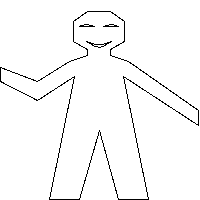

# Exercise 2.52

Make changes to the square limit of `wave` shown in Figure 2.9 by working at
each of the levels described above. In particular:

1. Add some segments to the primitive wave painter of [Exercise 2.49](./2.49.md)
   (to add a smile, for example).
2. Change the pattern constructed by `corner-split` (for example, by using only
   one copy of the `up-split` and `right-split` images instead of two).
3. Modify the version of square-limit that uses `square-of-four` so as to
   assemble the corners in a different pattern. (For example, you might make the
   big Mr. Rogers look outward from each corner of the square.)

## Answer

This exercise seems to let's us has a feel of the _Stratified design_ idea. So,
I don't think the code are needed (perhaps, I'm just getting lazy).

