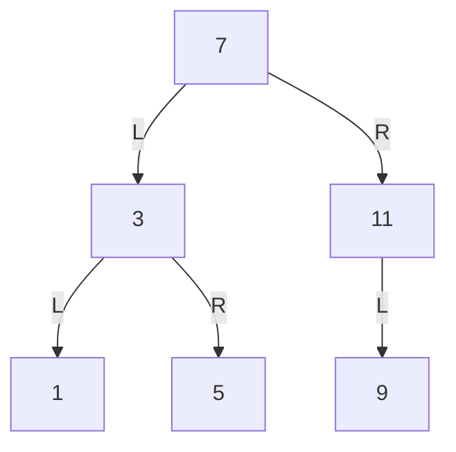

# Exercise 2.64

The following procedure `list->tree` converts an ordered list to a balanced
binary tree. The helper procedure `partial-tree` takes as arguments an integer
$n$ and list of at least $n$ elements and constructs a balanced tree containing
the first $n$ elements of the list.

The result returned by `partial-tree` is a pair (formed with `cons`) whose `car`
is the constructed tree and whose `cdr` is the list of elements not included in
the tree.

```scheme
(define (list->tree elements)
  (car (partial-tree
        elements (length elements))))

(define (partial-tree elts n)
  (if (= n 0)
      (cons '() elts)
      (let ((left-size
             (quotient (- n 1) 2)))
        (let ((left-result
               (partial-tree
                elts left-size)))
          (let ((left-tree
                 (car left-result))
                (non-left-elts
                 (cdr left-result))
                (right-size
                 (- n (+ left-size 1))))
            (let ((this-entry
                   (car non-left-elts))
                  (right-result
                   (partial-tree
                    (cdr non-left-elts)
                    right-size)))
              (let ((right-tree
                     (car right-result))
                    (remaining-elts
                     (cdr right-result)))
                (cons (make-tree this-entry
                                 left-tree
                                 right-tree)
                      remaining-elts))))))))
```

1. Write a short paragraph explaining as clearly as you can how `partial-tree`
   works. Draw the tree produced by `list->tree` for the list `(1 3 5 7 9 11)`.

2. What is the order of growth in the number of steps required by `list->tree`
   to convert a list of $n$ elements?

## Answer

> Draw the tree produced by `list->tree` for the list `(1 3 5 7 9 11)`.



😀 This is [109. Convert Sorted List to Binary Search Tree][lc-109] on Leetcode.
The idea of `partial-tree` is quite brilliant: Takes a `start` pointer and a
number $count$ indicates how many nodes in the resulted tree. Then:

- Return either:

  - `null` if $count$ is zero, which mean the subtree is empty
  - **2 things**: the tree it builds, and the pointer to unused part.

- For the non-trivial case where $count > 0$:
  - Recursively builds the left subtree with $count \% 2$ nodes and same
    `start`
  - Build a tree which the middle node is the first node pointed by the _rest_
    pointer returned from above recursive call, the returned left subtree, and
    the right subtree, which is built by anther recursive call

**Time**: Find the length of the list is $\Theta(n)$. The recursive part is a
bit tricky. It looks like $\Theta(log\space n)$ due to the modulo 2, but it's
actually is $\Theta(n)$ since we need to visit each node at least once.

**Space**: $\Theta(log\space n)$ for the recursion stack.

[lc-109]:
  https://leetcode.com/problems/convert-sorted-list-to-binary-search-tree/

For reference, here's my implementation without parsing the provided code.

```scheme
(define (list->tree vs)
  (define (build start n)
    (if (= n 0)
        (list null start)
        (let* ([left-size (quotient n 2)]
               [right-size (- n left-size 1)]
               [left-result (build start left-size)]
               [left-tree (car left-result)]
               [next (cadr left-result)]
               [right-result (build (cdr next) right-size)]
               [right-tree (car right-result)]
               [remain (cadr right-result)])
          (list (make-tree (car next) left-tree right-tree)
                remain))))
  (car (build vs (length vs))))
```
