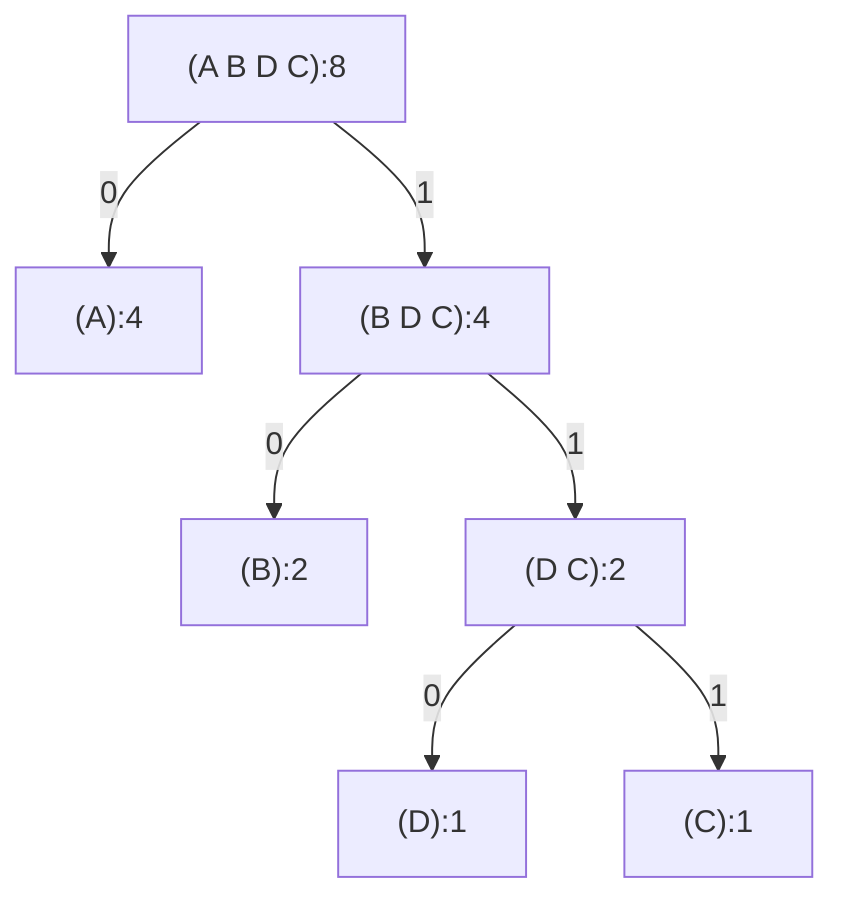

# Exercise 2.67

Define an encoding tree and a sample message:

```scheme
(define sample-tree
  (make-code-tree
   (make-leaf 'A 4)
   (make-code-tree
    (make-leaf 'B 2)
    (make-code-tree
     (make-leaf 'D 1)
     (make-leaf 'C 1)))))

(define sample-message
  '(0 1 1 0 0 1 0 1 0 1 1 1 0))
```

Use the decode procedure to decode the message, and give the result.

## Answer

The tree is



Code table

| Symbol | Code | Steps | Weight | Cost, ∑=14 |
| ------ | ---- | ----- | ------ | ---------- |
| A      | 0    | 1     | 4      | 4          |
| B      | 10   | 2     | 2      | 4          |
| D      | 110  | 3     | 1      | 3          |
| C      | 111  | 3     | 1      | 3          |

The decoded message is

```scheme
'(A D A B B C A)
;'(0   1 1 0   0   1 0   1 0   1 1 1   0))
;  A   D       A   B     B     C       A
```

See [`./huffman.rkt`](./huffman.rkt) for the related code. Note that I
deliberate implemented the Huffman algorithm differently compare to the book, as
I want to reuse code from [`./set-tree.rkt`](./set-tree.rkt), especially the
`fmt-mermaid` procedure.
