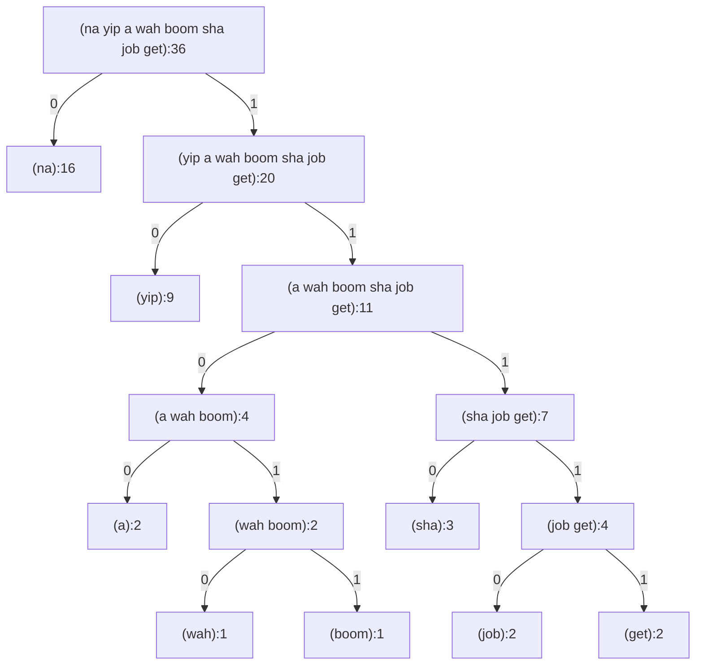

# Exercise 2.70

The following eight-symbol alphabet with associated relative frequencies was
designed to efficiently encode the lyrics of 1950s rock songs. (Note that the
“symbols” of an “alphabet” need not be individual letters.)

```
A    2    NA  16
BOOM 1    SHA  3
GET  2    YIP  9
JOB  2    WAH  1
```

Use `generate-huffman-tree` ([Exercise 2.69](./2.69.md)) to generate a
corresponding Huffman tree, and use `encode` ([Exercise 2.68](./2.68.md)) to
encode the following message:

```
get a job
sha na na na na na na na na

get a job
sha na na na na na na na na

wah yip yip yip yip
yip yip yip yip yip
sha boom
```

How many bits are required for the encoding? What is the smallest number of bits
that would be needed to encode this song if we used a fixed-length code for the
eight-symbol alphabet?

## Answer

The exercise doesn't give the frequencies for space, new line. So I guess we
will just put the lyrics into a quoted list as is.

```scheme
(define (ex-2.70)
  (define msg
    '(get a job
      sha na na na na na na na na

      get a job
      sha na na na na na na na na

      wah yip yip yip yip
      yip yip yip yip yip
      sha boom))
  (define bits (huffman-encode msg tree-2.70))
  (debug (length msg))
  (debug bits)
  (debug (length bits)))

(ex-2.70)
> (length msg) = 36
> bits = (1 1 1 1 1 1 1 0 0 1 1 1 1 0 1 1 1 0 0 0 0 0 0 0 0 0 1 1 1 1 1 1 1 0 0 1 1 1 1 0 1 1 1 0 0 0 0 0 0 0 0 0 1 1 0 1 0 1 0 1 0 1 0 1 0 1 0 1 0 1 0 1 0 1 0 1 1 1 0 1 1 0 1 1)
> (length bits) = 84
```

Note: `debug` is my util in [`../../utils/debug.rkt`](../../utils/debug.rkt).

To encode the lyrics (36 symbols) using fixed-length code 8 unique symbols, we
need

- 3 bits per unique symbol.
- 108 bits total.

### Extra

Here's the Huffman tree and its code table.



| Symbol | Code  | Steps | Weight | Cost, ∑=84 |
| ------ | ----- | ----- | ------ | ---------- |
| na     | 0     | 1     | 16     | 16         |
| yip    | 10    | 2     | 9      | 18         |
| a      | 1100  | 4     | 2      | 8          |
| wah    | 11010 | 5     | 1      | 5          |
| boom   | 11011 | 5     | 1      | 5          |
| sha    | 1110  | 4     | 3      | 12         |
| job    | 11110 | 5     | 2      | 10         |
| get    | 11111 | 5     | 2      | 10         |
