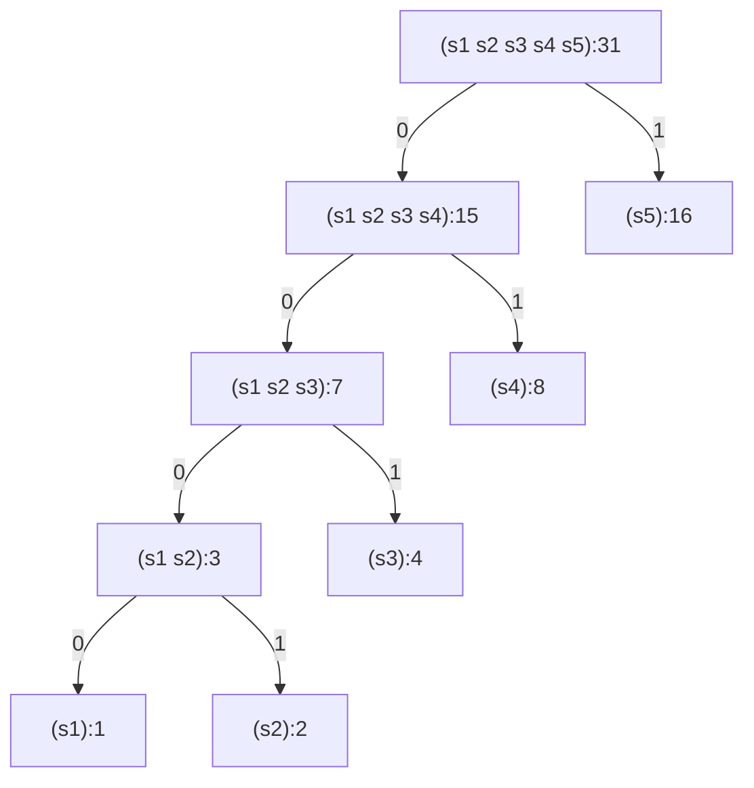
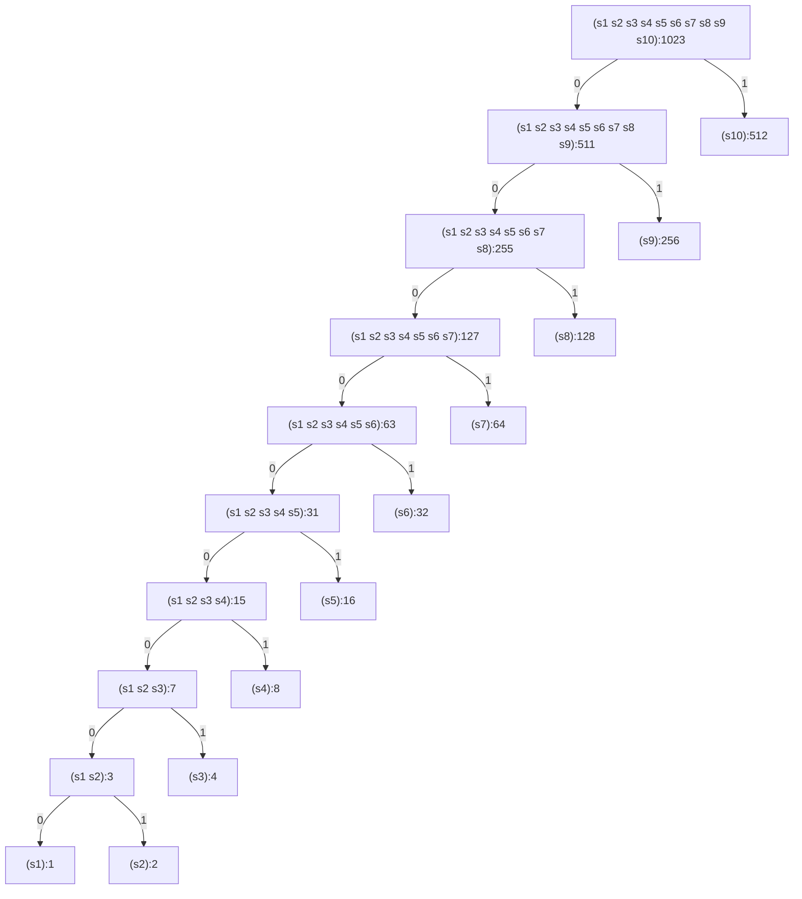

# Exercise 2.71

Suppose we have a Huffman tree for an alphabet of $n$ symbols, and that the
relative frequencies of the symbols are $1,2,4,…,2^{n-1}$. Sketch the tree for
$n=5$; for $n=10$.

In such a tree (for general $n$) how many bits are required to encode the most
frequent symbol? The least frequent symbol?

## Answer

## Sketch the trees

### $n=5$

| Symbol | Code | Steps | Weight | Cost, ∑=56 |
| ------ | ---- | ----- | ------ | ---------- |
| s1     | 0000 | 4     | 1      | 4          |
| s2     | 0001 | 4     | 2      | 8          |
| s3     | 001  | 3     | 4      | 12         |
| s4     | 01   | 2     | 8      | 16         |
| s5     | 1    | 1     | 16     | 16         |

### $n=10$

| Symbol | Code      | Steps | Weight | Cost, ∑=2035 |
| ------ | --------- | ----- | ------ | ------------ |
| s1     | 000000000 | 9     | 1      | 9            |
| s2     | 000000001 | 9     | 2      | 18           |
| s3     | 00000001  | 8     | 4      | 32           |
| s4     | 0000001   | 7     | 8      | 56           |
| s5     | 000001    | 6     | 16     | 96           |
| s6     | 00001     | 5     | 32     | 160          |
| s7     | 0001      | 4     | 64     | 256          |
| s8     | 001       | 3     | 128    | 384          |
| s9     | 01        | 2     | 256    | 512          |
| s10    | 1         | 1     | 512    | 512          |

## Bit count per symbol

Let's use $b_i$ ($1\le i \le n$) to denotes the number of bits needed to encode
symbol $s_i$ in the kind of tree described by the exercise. It's easy to see and
prove by induction that $b_1 = n-1$ and:

$$
b_i = n - i + 1 \quad \forall i\gt 1
$$

Hence:

- Most frequent symbol need 1 bit.
- Least frequent symbol need $n-1$ bits
