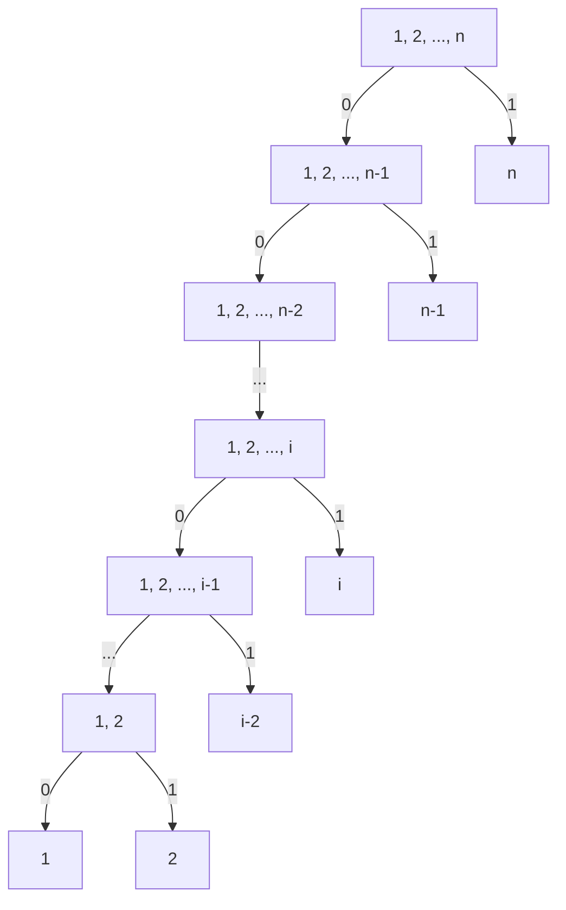
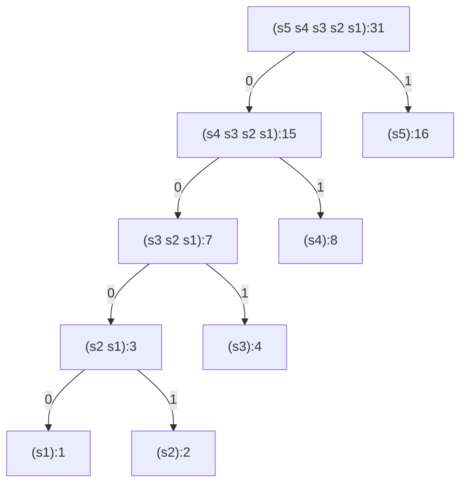

# Exercise 2.72

Consider the encoding procedure that you designed in [Exercise 2.68](./2.68.md).
What is the order of growth in the number of steps needed to encode a symbol? Be
sure to include the number of steps needed to search the symbol list at each
node encountered.

To answer this question in general is difficult. Consider the special case where
the relative frequencies of the $n$ symbols are as described in
[Exercise 2.71](./2.71.md), and give the order of growth (as a function of $n$)
of the number of steps needed to encode the most frequent and least frequent
symbols in the alphabet.

## Answer

<!-- toc -->

- [Special case](#special-case)
  - [Time to encode 2 special symbols](#time-to-encode-2-special-symbols)
  - [Time to encode other symbols](#time-to-encode-other-symbols)
  - [Time to encode a message](#time-to-encode-a-message)
  - [Optimizations](#optimizations)
    - [Use hash table](#use-hash-table)
    - [Sort symbols in decreasing order](#sort-symbols-in-decreasing-order)
  - [Comparisons](#comparisons)
- [General case](#general-case)

<!-- tocstop -->

### Special case

The special tree from [Ex 2.71](./2.71.md) would look like this:

Such tree have these properties:

- Every non-leaf nodes has 2 children
  - The right child is a leaf, contains only a symbol.
  - The left child is a non-leaf, contains the set of lower levels' symbols,
    **ordered increasingly by their weights**.
- Tree's height is $n$.
- The Most Frequent Symbol (MFS) is at level 1 (root is level 0), requires 1
  _turn right_ step to access.
- The Least Frequent Symbol (LFS) is at level $n-1$, requires $n-1$ _turn left_
  steps to access.

[My implementation](./huffman.rkt) is slightly different with the provided code
from the book. However, the result should be the same, as my version of
`adjoin-set` (called `huffman-adjoin-set` in my code) works exactly the same
with the book: **it creates an increasingly sorted list**. Thus, look up for
$s_i$ in a set contains $k \ge i$ items requires exactly $i$ comparisons.

#### Time to encode 2 special symbols

Encode the MFS needs to $n+1$ steps consists of:

- Visit all $n-1$ items in the left (to confirm that it's not there).
- 1 in the right.
- 1 step to go down from root.

Encode the LFS needs a $3(n-1)$ steps consists of:

- Visit the first item per left set, thus $n-1$ for all left nodes.
- 1 check per each right node, so, another $n-1$ operations.
- $n-1$ steps to down the tree.

Both the MFS and LFS need $\Theta(n)$ steps, but the LFS is 3 times slower.

#### Time to encode other symbols

In this section, we aim to answer the following question

> What is the order of growth in the number of steps needed to encode a symbol?

Let's define $E(i)$, where $2 \le i \le n$, as the function that compute the
number of steps to encode symbol $s_i$. $E(i)$ is the sum of:

- $n+1-i$: tree traversals, include $n-i$ to the left and 1 to the right.

- $(i+1)(n-i) + i$: set item comparisons.

  - $i$ comparisons per left sets that contains at least $i$ items. There are
    $n-i$ sets like that (whose last symbol indexes go from $n-1$ to $i$). Thus,
    there's $n-i$ left nodes for such sets.
  - 1 comparison per each right node of above $n-i$ left nodes.
  - $i - 1$ comparisons for the first left node that doesn't contains $s_i$.
  - 1 comparison for the leaf node that contains $s_i$.

Hence:

$$
\begin{split}
E(i) &= (i+1)(n-i) + i  + n+1-i \\
     &= (i+1)(n-i) + n+1
\end{split}
\tag{1}
$$

$s_1$ is special. Its number of steps is $E(1)-2$, because, if there's one more
level below $s_1$, we need

- 1 more comparison for the right node, because the left node contains 0 items.
- 1 more step to go to that level.

But we don't have that level, so we don't use to spend those 2 steps.

#### Time to encode a message

Let's define $f(i) = 2^{i-1}$ as the function that compute frequency of the
symbol $s_i$, $T(n)$ as the function that compute the sum of all products of the
encoding time and and the frequency of each symbol.

Let's define these functions:

- $f(i)$: frequency of the symbol $s_i$.

$$
f(i) = 2^{i-1}
$$

- $F(n)$: sum of all frequency $f(i)$

  $$
  \begin{split}
  F(n) & = \sum_{i=1}^n f(i)                   \\
       & = 1 + 2 + 2^2 + \cdots + 2^{n-1}      \\
       & = -1 + 2 + 2 + 2^2 + \cdots + 2^{n-1} \\
       & = -1 + 2^2 + 2^2 + \cdots + 2^{n-1}   \\
       & = 2^n - 1
  \end{split}
  $$

- $T(n)$: sum of all products of $f(i)$ and the encoding time of $s_i$,

  $$
  \begin{split}
  T(n) &= f(1)(E(1) - 2) + \sum_{i=2}^n f(i) E(i) \\
       &= -2 f(1) + f(1)E(1) + \sum_{i=2}^n f(i) E(i) \\
       &= -2 + \sum_{i=1}^n f(i) E(i) \\
       &= -2 + \sum_{i=1}^n 2^{i-1} \big[(i+1)(n-i) + n+1 \big] \\
       &= n(2^{n+1} - 1) - 2^n - 1
  \end{split}
  $$

  (I used Wolfram Alpha to get the closed-form formula of $n$. Once knowing,
  it's not difficult to prove using induction).

- $Avg(n)$: the average time to encode a symbol.

  $$
  \begin{split}
  Avg(n) &= \frac{T(n)}{F(n)}                                 \\
         &= \frac{n(2^{n+1} - 1) - 2^n - 1}{2^n -1}           \\
         &= \frac{n(2^{n+1} - 2 + 1) - (2^n - 1) -2 }{2^n -1} \\
         &= \frac{2n(2^n - 1) + n - 2 }{2^n -1} - 1           \\
         &= 2n - 1 + \frac{n - 2}{2^n -1}                     \\
  \end{split}
  \tag{1}
  $$

Then, the time complexity to encode a message of length $m$ composed from $n$
symbols is:

$$
\Theta(m Avg(n)) = \Theta \left(m(2n - 1) + \frac{m(n-2)}{2^n-1} \right)
$$

As $n \ll m$ in practice, we can't assume that the 2nd factor,
$\frac{m(n-2)}{2^n-1}$ will get to 0 when $m$ and $n$ are growing.

#### Optimizations

To optimize the overall encoding time, we should focus on reducing $E(i)$. Since
navigating the tree is unavoidable, we can only try to improve the symbol set
look up speed.

##### Use hash table

If we could use a hash table that support $O(1)$ average time to access its
items, we only need 1 look up per set to check if the symbol exists. Thus,
$E(i)$ will become

$$
\begin{split}
E(i) &= \underbrace{n+1 - i}_{\text{tree traversals}} +
       \underbrace{2(n - i) + 2}_{\text{look up times}} \\
    &= 3(n+1-i)
\end{split}
$$

Unlike before, time to encode $s_1$ is now $E(1) - 3$ (we might think of it as 1
step to compute the hash key to check on the hash table with 0 items, unlike
previously, no step to loop through a 0 item list)

With this new $E(i)$ formula, we can recompute $T(n)$

$$
\begin{split}
T_n &= -3  + \sum_{i=1}^n 2^{i-1} 3(n+1 - i) \\
    &= -3  + 3\sum_{i=1}^n 2^{i-1} (n+1 - i) \\
    &= 3\times 2^{n+1} - 3n - 9
\end{split}
$$

New $Avg(n)$ will be

$$
\begin{split}
Avg(n) &= \frac{3\times 2^{n+1} - 3n - 9}{2^n - 1} \\
       &= 6 - \frac{3n + 3}{2^n-1}                \\
\end{split}
$$

That's an impressive speed up!

##### Sort symbols in decreasing order

At the current point in the book, we don't have random access mechanism yet. The
only thing we can do with our Huffman encoding implementation is reverse the
sorting order. For example, take the case $n=5$, the tree will look like this:

For each symbol $s_i$, we still need to looks up in $n-i$ sets contains it and
the first one that doesn't contains it.

- Size $k$ of those $n-i$ sets that contains $s_i$ will go from $n-1$ to $i$.
  So, the total look up on these sets will be

  $$
  \sum_{k=i}^{n-1} k-i+1 = \frac{(n-i)(n+1 -i)}{2}
  $$

- 1 look up per right node for symbols that have higher frequency than $s_i$,
  thus, $n-i$ steps.
- 1 look up in the first left node that doens't contain $s_i$
- 1 look up for the leaf of $s_i$.

We also need $n+1-i$ tree traversals, so the new $E(i)$ formula is:

$$
\begin{split}
E(i) &= \frac{(n-i)(n+1 -i)}{2} + (n-i) + 2 + (n+1-i) \\
     &= \frac{(n-i)(n+5 -i)}{2} + 3 \\
\end{split}
$$

For $s_i$, we will need $E(1) - 3$. Like the case with hash table, our analysis
still assume 1 look up in a non-exists left node below $s_1$, 1 look up for the
non-exists right node and 1 step to go down the tree.

With the new $E(i)$, our $T(n)$ will become

$$
\begin{split}
T_n &= -3 + \sum_{i=1}^n 2^{i-1} \left(\frac{(n-i)(n+5 -i)}{2} + 3 \right) \\
    &= 7 \times 2^n -\frac{n^2 + 7n + 20}{2}
\end{split}
$$

New $Avg(n)$ will be

$$
\begin{split}
Avg(n) &= \frac{7 \times 2^n -\frac{n^2 + 7n + 20}{2}}{2^n - 1} \\
       &= 7 - \frac{n^2+7n+6}{2(2^n - 1)} \\
       &= 7 - \frac{(n+1)(n+6)}{2(2^n - 1)}
\end{split}
$$

#### Comparisons

Below table show how $Avg(n)$ grows with different methods.

| $n$ | List increasing | Hash table | List decreasing |
| --- | --------------- | ---------- | --------------- |
| 1   | 0               | 0          | 0               |
| 2   | 3               | 3          | 3               |
| 3   | 5.14286         | 4.28571    | 4.42857         |
| 4   | 7.13333         | 5          | 5.33333         |
| 5   | 9.09677         | 5.41935    | 5.93548         |
| 10  | 19.0078         | 5.96774    | 6.91398         |
| 15  | 29.004          | 5.99854    | 6.99487         |
| 20  | 39              | 5.99994    | 6.99974         |
| 30  | 59              | 6          | 7               |
| 50  | 99              | 6          | 7               |
| 100 | 199             | 6          | 7               |

We can see that although not as good as using a hash table, reversing the symbol
set orders is still a massive improvement. I can't help but wonder why the book
didn't mention this technique.

### General case

> TODO (tai):
