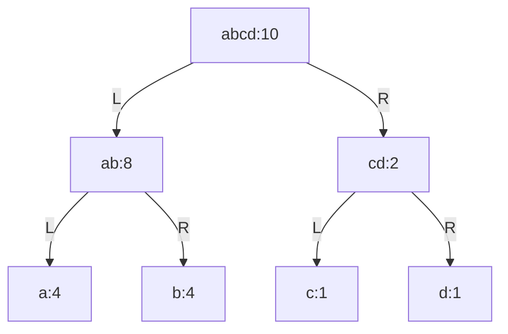
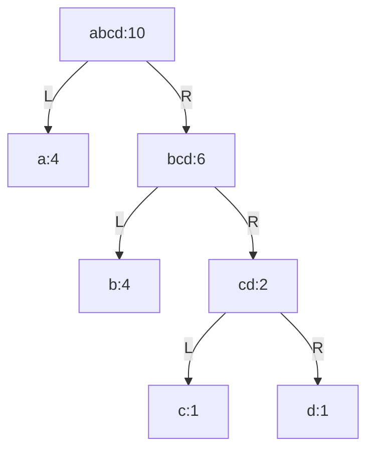

# Huffman encoding

## Idea

> How to construct the "best" code for a symbols and relative frequencies table?

I'll attempt to answer that question before learn the solution from the book.

We know that:

- Huffman encoding works as a tree.
- Symbols' _weights_ are used to build the _optimal_ tree.

What's optimal here? The encoding is used to compress information. So, encoded
message should be as small as possible. That means the tree should be built such
that if we look up a bunch of random symbols with the same distribution rate
with the frequencies tables, we should need minimal steps.

For the 4 symbols with these coressponding frequencies $a=b=4$, $c=d=1$, the
below encoding is not optimal.

If we search for 4 $a$, 4 $b$ and a pair of $c$ and $d$, we will need
$4*2*2 + 2*2 = 20$ steps. On the other hand, the following encoding only need 18
steps ($4 + 4*2 + 1*2*3$).

Before we continue, let's define

- $W(x)$ is sum of weight of all children of node $x$.
  - In the 1st tree, $W(ab) = 8$
  - In the 2nd tree, $W(bcd) = 4$
- $D(x) = |W(left(x)) - W(right(x))|$
  - In the 1st tree, $D(ab) = 0$, $D(abcd) = 6$
  - In the 2nd tree, $D(abcd) = D(bcd) = 2

I believe the strategy to general the optimal tree is to _ensure minimal
different between weighted sum of 2 branches of each node_.

For the 1st tree, $D(abcd) = 6$, too high, even though all other nodes has 0
difference between their branches. If we swap `b:4` and `c:1` locations, we
still get 3 for the all middle nodes.

On the other hands, max difference of the 2nd tree is only 2.

I can't prove the idea. Further searching show that Huffman encoding actually
works by recursively combining 2 smallest symbols to form a new meta-symbol util
we reach the root node. See the below link for a really good and complete proof:

https://www.cs.umd.edu/class/fall2017/cmsc451-0101/Lects/lect06-greedy-huffman.pdf

I also learned about a similar, but more general concept called
[Weight-balanced tree](https://en.wikipedia.org/wiki/Weight-balanced_tree). The
wiki page say that Huffman coding is an _example_ of such tree. So, I guess, my
idea is correct. However, I can't find an algorithm to construct the tree using
that idea. Huffman algorithm is much simpler.

## Implementation

Problems: how to sort the list, when the book hasn've introduce sorting?

...(after complete ex 2.67 to 2.70)...

The solution from the book is basically insertion sort.
